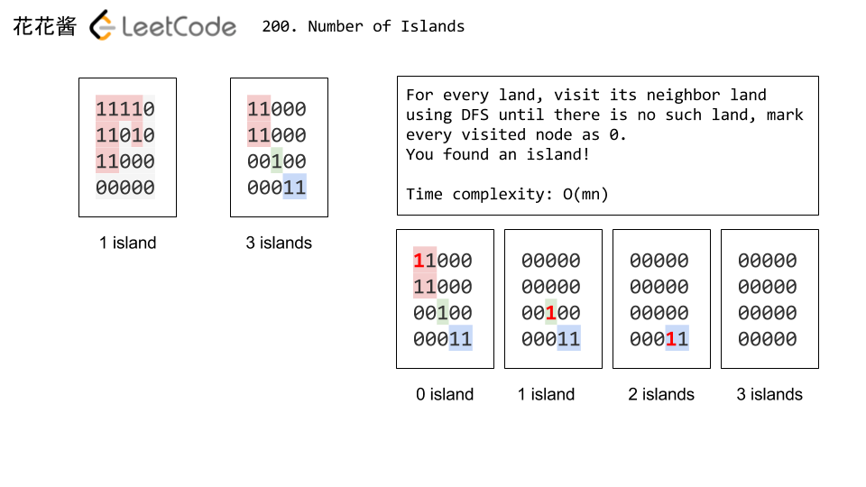

# Leetcode 200. Number of Islands

Given a 2d grid map of  `'1'`s (land) and  `'0'`s (water), count the number of islands. An island is surrounded by water and is formed by connecting adjacent lands horizontally or vertically. You may assume all four edges of the grid are all surrounded by water.

**Example 1:**

**Input:**
11110
11010
11000
00000

**Output:** 1

**Example 2:**

**Input:**
11000
11000
00100
00011

**Output:** 3

**Difficulty**:Medium

**Category**:

# Analyze

题目大意：统计岛屿的数量，就是求矩阵中连续`1`区域的个数。



用深度优先搜索DFS来解，我们需要建立一个visited数组用来记录某个位置是否被访问过，对于一个为‘1’且未被访问过的位置，我们递归进入其上下左右位置上为‘1’的数，将其周围所有的 `1` 都换成 `0`.


# Solution

## Solution 1: DFS

Cite: [LeetCode 200. Number of Islands](https://zxi.mytechroad.com/blog/searching/leetcode-200-number-of-islands/)

Use DFS to find a connected component (an island) and mark all the nodes to 0.

Time complexity: O(mn)
Space complexity: O(mn)

```cpp
class Solution {
 public:
  int numIslands(vector<vector<char>>& grid) {
    if (grid.empty()) return 0;
    int m = grid.size();
    int n = grid[0].size();
    int ans = 0;
    for (int y = 0; y < m; ++y)
      for (int x = 0; x < n; ++x) {
        ans += grid[y][x] - '0';
        dfs(grid, x, y, m, n);
      }
    return ans;
  }

 private:
  void dfs(vector<vector<char>>& grid, int x, int y, int m, int n) {
    if (x < 0 || y < 0 || x >= n || y >= m || grid[y][x] == '0') return;
    // Change all the grid[y][x] to '0'
    grid[y][x] = '0';
    dfs(grid, x + 1, y, m, n);
    dfs(grid, x - 1, y, m, n);
    dfs(grid, x, y + 1, m, n);
    dfs(grid, x, y - 1, m, n);
  }
};
```

另外，也可以单独建立一个数组来做统计的情况：

```cpp
class Solution {
 public:
  int numIslands(vector<vector<char> > &grid) {
    if (grid.empty() || grid[0].empty()) return 0;
    int m = grid.size(), n = grid[0].size(), res = 0;
    vector<vector<bool> > visited(m, vector<bool>(n, false));
    for (int i = 0; i < m; ++i) {
      for (int j = 0; j < n; ++j) {
        if (grid[i][j] == '1' && !visited[i][j]) {
          numIslandsDFS(grid, visited, i, j);
          ++res;
        }
      }
    }
    return res;
  }
  void numIslandsDFS(vector<vector<char> > &grid, vector<vector<bool> > &visited, int x, int y) {
    if (x < 0 || x >= grid.size()) return;
    if (y < 0 || y >= grid[0].size()) return;
    if (grid[x][y] != '1' || visited[x][y]) return;
    visited[x][y] = true;
    numIslandsDFS(grid, visited, x - 1, y);
    numIslandsDFS(grid, visited, x + 1, y);
    numIslandsDFS(grid, visited, x, y - 1);
    numIslandsDFS(grid, visited, x, y + 1);
  }
};
```