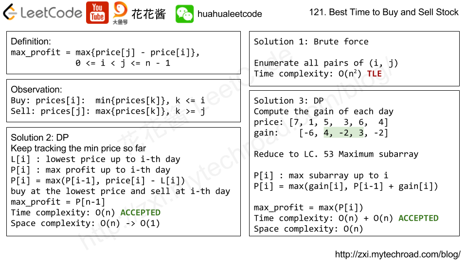

# Leetcode 121. Best Time to Buy and Sell Stock

题目大意: 给你一只股票每天的价格，如果只能做一次交易（一次买进一次卖出）问你最多能赚多少钱。

Say you have an array for which the  _i_th  element is the price of a given stock on day  _i_.

If you were only permitted to complete at most one transaction (i.e., buy one and sell one share of the stock), design an algorithm to find the maximum profit.

Note that you cannot sell a stock before you buy one.

**Example 1:**
> **Input:** [7,1,5,3,6,4]
> **Output:** 5
> **Explanation:** Buy on day 2 (price = 1) and sell on day 5 (price = 6), profit = 6-1 = 5. Not 7-1 = 6, as selling price needs to be larger than buying price.

**Example 2:**

> **Input:** [7,6,4,3,1]
> **Output:** 0
> **Explanation:** In this case, no transaction is done, i.e. max profit = 0.

<!-- more -->

# Solution



```cpp
class Solution {
 public:
  int maxProfit(vector<int>& prices) {
    if (prices.empty()) return 0;
    int preMin = prices[0], curMax = 0, maxPrice = 0;
    for (int i = 0; i < prices.size(); ++i) {
      if (prices[i] > curMax) {
        curMax = prices[i];
        maxPrice = max(maxPrice, curMax - preMin);
      }

      if (prices[i] < preMin) {
        curMax = 0;
        preMin = prices[i];
      }
    }
    return maxPrice;
  }
};
```

## Solution 1: DP

只需要遍历一次数组，用一个变量记录遍历过数中的最小值，然后每次计算当前值和这个最小值之间的差值最为利润，然后每次选较大的利润来更新。当遍历完成后当前利润即为所求

Time Complexity: O(n)
Space Complexity: O(1)

```cpp
class Solution {
 public:
  int maxProfit(vector<int>& prices) {
    int res = 0, buy = INT_MAX;
    for (int price : prices) {
      buy = min(buy, price);
      res = max(res, price - buy);
    }
    return res;
  }
};
```

## Solution 2: Maximum Subarray question

```cpp
class Solution {
 public:
  int maxProfit(vector<int>& prices) {
    int n = prices.size();
    if (n < 2) return 0;
    vector<int> gains(n - 1, 0);
    for (int i = 1; i < n; ++i) gains[i - 1] = prices[i] - prices[i - 1];
    return max(0, maxSubArray(gains));
  }

 private:
  // From LC 53. Maximum Subarray
  int maxSubArray(vector<int>& nums) {
    vector<int> f(nums.size());
    f[0] = nums[0];

    for (int i = 1; i < nums.size(); ++i) f[i] = max(f[i - 1] + nums[i], nums[i]);

    return *std::max_element(f.begin(), f.end());
  }
};
```

# Relative Problems

