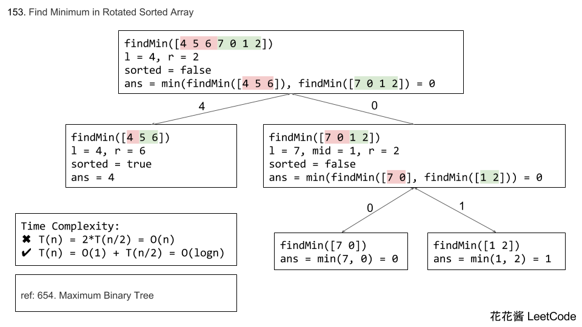

# Leetcode 153. Find Minimum in Rotated Sorted Array

Suppose an array sorted in ascending order is rotated at some pivot unknown to you beforehand.

(i.e., `[0,1,2,4,5,6,7]` might become `[4,5,6,7,0,1,2]`).

Find the minimum element.

You may assume no duplicate exists in the array.

**Example 1:**

**Input:** [3,4,5,1,2] 
**Output:** 1

**Example 2:**

**Input:** [4,5,6,7,0,1,2]
**Output:** 0

**Difficulty**:Medium

**Category**:

# Analyze

这道题目给的输入有两种情况，有可能输入是旋转有序数组，也有可能是没有旋转的有序输入，这个可以通过比较最后一个元素与第一个元素的大小来判断， 如果第一个元素比最后一个元素小，那就说明这个输入的数组并没有旋转。反之，则表示输入的是一个旋转数组。

Cite: [花花酱 Leetcode 153. Find Minimum in Rotated Sorted Array](https://zxi.mytechroad.com/blog/leetcode/leetcode-153-find-minimum-in-rotated-sorted-array/)




# Solution

## Binary Search

Time Complexity: O(log n), Space Complexity:O(1)

```cpp
class Solution {
 public:
  int findMin(vector<int>& nums) {
    int left = 0, right = nums.size() - 1;
    if (nums[left] < nums[right]) return nums[0];

    while (left < right - 1) {
      int mid = left + (right - left) / 2;

      // If the mid value > left value, then move the right part search.
      if (nums[mid] > nums[left]) left = mid;
      else right = mid;
    }
    return min(nums[left], nums[right]);
  }
};
```

## Solution 2: Divide and conquer

Time complexity: T(n) = O(1) + T(n/2) = O(log n)

```cpp
class Solution {
 public:
  int findMin(vector<int>& num) { 
    return findMin(num, 0, num.size() - 1);
  }

 private:
  int findMin(const vector<int>& num, int l, int r) {
    // Only 1 or 2 elements
    if (l + 1 >= r) return min(num[l], num[r]);

    // Sorted
    if (num[l] < num[r]) return num[l];

    int mid = l + (r - l) / 2;
    return min(findMin(num, l, mid - 1), findMin(num, mid, r));
  }
};

```