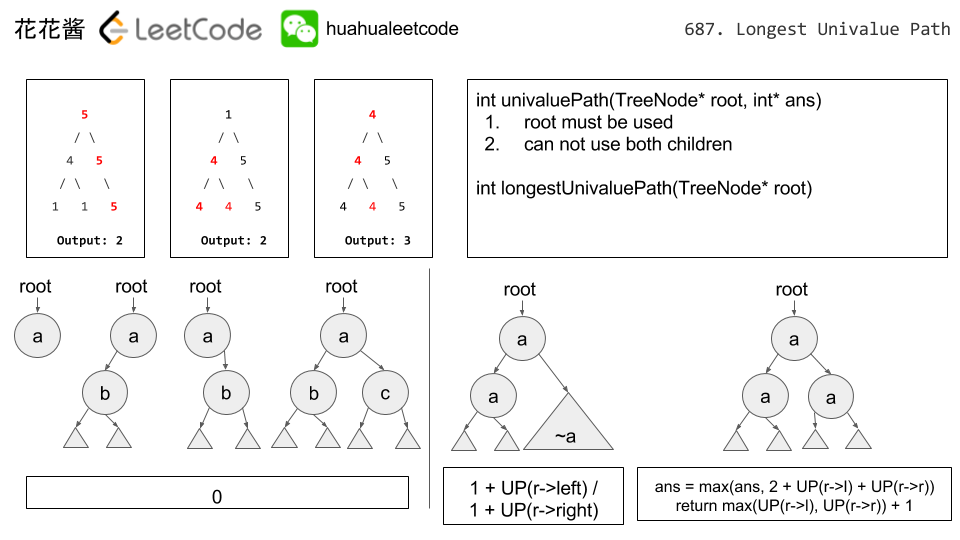

# Question

Given a binary tree, find the length of the longest path where each node in the path has the same value. This path may or may not pass through the root.

**Note:**  The length of path between two nodes is represented by the number of edges between them.


**Note:**  The given binary tree has not more than 10000 nodes. The height of the tree is not more than 1000.

**Difficulty**:Easy

**Category**:Tree, Recursion

# Analyze

This problem: You need to find the longest path which each node have the same value in this tree.(The path can pass the root node.) **The output value not the node number. It is the side numbers.**


You can use the left len and right len and the root node together.

> Output 3 is `2`, not `3`.

# Solution

## Solution 1: dfs



Time complexity: O(n)
Space complexity: O(n)

> Runtime: 140 ms, faster than 93.41% of C++ online submissions for Longest Univalue Path.
> Memory Usage: 50.2 MB, less than 47.32% of C++ online submissions for Longest Univalue Path.

```cpp
class Solution {
 public:
  int longestUnivaluePath(TreeNode* root) {
    int max_len = 0;
    dfs(root, max_len);
    return max_len;
  }

 private:
  int dfs(TreeNode* root, int& max_len) {
    if (!root) return 0;
    int l = dfs(root->left, max_len);
    int r = dfs(root->right, max_len);
    int l_len = 0, r_len = 0;

    // The l is the long for the root->left, So, it need to return l_len
    if (root->left && root->left->val == root->val) l_len = l + 1;
    if (root->right && root->right->val == root->val) r_len = r + 1;

    // The path may pass the root node
    max_len = max(max_len, l_len + r_len);
    return max(l_len, r_len);
  }
};
```

其他类似解法可参考博客：[Longest Univalue Path 最长相同值路径](http://www.cnblogs.com/grandyang/p/7636259.html)