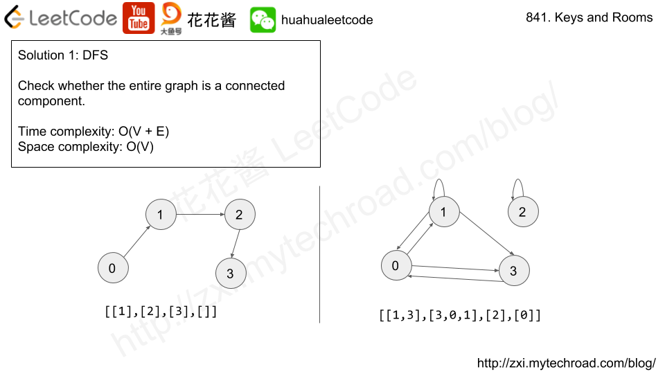

# Leetcode 841. Keys and Rooms

There are  `N`  rooms and you start in room  `0`. Each room has a distinct number in  `0, 1, 2, ..., N-1`, and each room may have some keys to access the next room.

Formally, each room  `i` has a list of keys  `rooms[i]`, and each key  `rooms[i][j]`  is an integer in  `[0, 1, ..., N-1]`  where  `N = rooms.length`. A key  `rooms[i][j] = v` opens the room with number  `v`.

Initially, all the rooms start locked (except for room  `0`).

You can walk back and forth between rooms freely.

Return  `true` if and only if you can enter every room.

**Example 1:**

**Input:** [[1],[2],[3],[]]
**Output:** true
**Explanation:**

We start in room 0, and pick up key 1.
We then go to room 1, and pick up key 2.
We then go to room 2, and pick up key 3.
We then go to room 3.  Since we were able to go to every room, we return true.

**Example 2:**

**Input:** [[1,3],[3,0,1],[2],[0]]
**Output:** false
**Explanation:** We can't enter the room with number 2.

**Note:**

1. `1 <= rooms.length <= 1000`
2. `0 <= rooms[i].length <= 1000`
3. The number of keys in all rooms combined is at most `3000`.

**Difficulty**:Medium

**Category**:

# Solution



## Solution 1: DFS

Time complexity: O(V + E), Space complexity: O(V)

```cpp
class Solution {
 public:
  bool canVisitAllRooms(vector<vector<int>>& rooms) {
    unordered_set<int> visited;
    dfs(rooms, 0, visited);
    return visited.size() == rooms.size();
  }

 private:
  void dfs(const vector<vector<int>>& rooms, int cur, unordered_set<int>& visited) {
    // Check if we visit the cur room...
    if (visited.count(cur)) return;
    visited.insert(cur);
    for (int nroom : rooms[cur]) dfs(rooms, nroom, visited);
  }
};
```