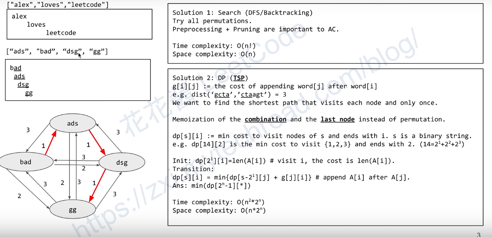

# Question

Given an array A of strings, find any smallest string that contains each string in  `A`  as a substring.

We may assume that no string in  `A`  is substring of another string in  `A`.

**Example 1:**

**Input:** ["alex","loves","leetcode"]
**Output:** "alexlovesleetcode"
**Explanation:** All permutations of "alex","loves","leetcode" would also be accepted.

**Example 2:**

**Input:** ["catg","ctaagt","gcta","ttca","atgcatc"]
**Output:** "gctaagttcatgcatc"

**Note:**

1. `1 <= A.length <= 12`
2. `1 <= A[i].length <= 20`

**Difficulty**:Hard

**Category**:

<!-- more -->

# Analyze

在这道题目的输入规模情况，可以得到， 这个规模可以 $O(n^2)$



可以將这道题目转化为图的问题来进行求解，

# Solution

```cpp
class Solution {
 public:
  string shortestSuperstring(vector<string>& A) {
    const int n = A.size();

    // 预处理阶段： 计算將单词 j 接到单词  i 后面的最小 Cost 是多少
    g_ = vector<vector<int>>(n, vector<int>(n));
    for (int i = 0; i < n; ++i)
      for (int j = 0; j < n; ++j) {
        g_[i][j] = A[j].length();
        for (int k = 1; k <= min(A[i].length(), A[j].length()); ++k)
          if (A[i].substr(A[i].size() - k) == A[j].substr(0, k))
            g_[i][j] = A[j].length() - k; // g_[i][j]表示將单词 j 放在 i后面
      }
    vector<int> path(n， -1); // 当前的路径---各个单词的 index
    best_len_ = INT_MAX;
    dfs(A, 0, 0, 0, path);

    string ans = A[best_path_[0]];
    for (int k = 1; k < best_path_.size(); ++k) {
      int i = best_path_[k - 1];
      int j = best_path_[k];
      ans += A[j].substr(A[j].length() - g_[i][j]);
    }
    return ans;
  }

 private:
  vector<vector<int>> g_;  //预处理
  vector<int> best_path_;
  int best_len_;
  // d: 当前搜素的深度， uesd: 表示那些单词已经被使用了， cur_len 当前路径所有单词的长度和
  void dfs(const vector<string>& A, int d, int used, int cur_len, vector<int>& path) {
    // 剪枝处理
    if (cur_len >= best_len_) return;
    if (d == A.size()) { // 表示所有的单词已经全部使用过了， 当前最优解
      best_len_ = cur_len;
      best_path_ = path;
      return;
    }

    for (int i = 0; i < A.size(); ++i) {
      if (used & (1 << i)) continue; // 判断当前单词是否已经使用过了
      path[d] = i; // 表示第 d 步使用的是 A[i] 这个单词
      dfs(A, d + 1, used | (1 << i), d == 0 ? A[i].length() : cur_len + g_[path[d - 1]][i], path);
      path[d] = -1;
    }
  }
};
```

## Solution 1: Search(DFS) + Pruning

Time complexity: O(n!)
Space complexity: O(n)

```cpp
// Runtime: 1076 ms, faster than 7.41% of C++ online submissions for Find the Shortest Superstring.
// Memory Usage: 9.7 MB, less than 100.00% of C++ online submissions for Find the Shortest Superstring.
class Solution {
 public:
  string shortestSuperstring(vector<string>& A) {
    const int n = A.size();

    v_ = vector<vector<int>>(n, vector<int>(n, 0));
    for (int i = 0; i < n; ++i) {
      for (int j = 0; j < n; ++j) {
        v_[i][j] = A[j].length();
        int p_len = A[i].length(), s_len = A[j].length();
        for (int cnt = min(p_len, s_len); cnt >= 0; --cnt)
          if (A[i].substr(p_len - cnt) == A[j].substr(0, cnt)) {
            v_[i][j] = s_len - cnt;
            break;
          }
      }
    }

    vector<int> path(n, -1);
    best_len = INT_MAX;
    shortestSuperstringDFS(A, 0, 0, 0, path);

    string ans = A[best_path[0]];
    for (int i = 1; i < best_path.size(); ++i) {
      int left = best_path[i - 1], right = best_path[i];
      ans += A[right].substr(A[right].length() - v_[left][right]);
    }
    return ans;
  }

 private:
  vector<vector<int>> v_;
  vector<int> best_path;
  int best_len;

  void shortestSuperstringDFS(vector<string>& A, int index, int used, int cur_len, vector<int>& path) {
    if (cur_len >= best_len) return;
    if (index == A.size()) {
      best_len = cur_len;
      best_path = path;
      return;
    }

    for (int i = 0; i < A.size(); ++i) {
      if (used & (1 << i)) continue;
      path[index] = i;
      shortestSuperstringDFS(A, index + 1, used | (1 << i),
                             index == 0 ? A[i].length() : cur_len + v_[path[index - 1]][i], path);
      path[index] = -1;
    }
  }
};
```

## Solution 2: DP

```cpp
class Solution {
 public:
  string shortestSuperstring(vector<string>& A) {
    const int n = A.size();

    // g[i][j] is the cost of appending word[j] after word[i], or weight of edge[i][j].
    // 计算 Cost
    vector<vector<int>> g(n, vector<int>(n));
    for (int i = 0; i < n; ++i)
      for (int j = 0; j < n; ++j) {
        g[i][j] = A[j].length();
        for (int k = 1; k <= min(A[i].length(), A[j].length()); ++k)
          if (A[i].substr(A[i].size() - k) == A[j].substr(0, k)) g[i][j] = A[j].length() - k;
      }

    // dp[s][i] := min distance to visit nodes (represented as a binary state s) once and only once and the path ends
    // with node i.e.g. dp[7][1] is the min distance to visit nodes (0, 1, 2) and ends with node 1, the possible paths
    // could be (0, 2, 1), (2, 0, 1).
    // dp 的第一维代表的是状态， 表示是否使用了这一个结点， 初始数值设置为 INT_MAX/2防止溢出
    vector<vector<int>> dp(1 << n, vector<int>(n, INT_MAX / 2));

    // 使用Parent 来记录 dp 的状态是由那一个状态转移过来的
    vector<vector<int>> parent(1 << n, vector<int>(n, -1));

    // 设置初始数值， 只访问第 i 个结点， 对应的初始数值。
    for (int i = 0; i < n; ++i) dp[1 << i][i] = A[i].length();

    // 枚举所有的状态， 从小到大
    for (int s = 1; s < (1 << n); ++s) {
      // 结尾的结点
      for (int j = 0; j < n; ++j) {
        // s 的 第 ‘i’ 不为 1 的话， 表示藏歌状态是不存在的
        // 需要保证处理的时候， j 这一个结点是已经访问过了的， 如果没有访问， 那么就跳过
        // s表示当前的结点， 必须是以 j 结尾的。
        if (!(s & (1 << j))) continue;
        //得到上一个状态
        int ps = s & ~(1 << j);
        for (int i = 0; i < n; ++i) {
          // 找到一个最短的路径
          if (dp[ps][i] + g[i][j] < dp[s][j]) {
            dp[s][j] = dp[ps][i] + g[i][j];
            // 存储这个路径的由来
            parent[s][j] = i;
          }
        }
      }
    }

    // 找到最后一个， 所有节点否访问过的情况
    // 恢复路径， 找到最优路径
    auto it = min_element(begin(dp.back()), end(dp.back()));
    int j = it - begin(dp.back());  // 得到最后是以那一个结点结尾
    int s = (1 << n) - 1;           //表示所有的结点都访问过了
    string ans;
    while (s) {
      int i = parent[s][j];  //找到上一个结点
      if (i < 0)             // 表示已经找到最后的一个了，初始的时候初始数值为 -1
        ans = A[j] + ans;
      else
        ans = A[j].substr(A[j].length() - g[i][j]) + ans;  // 得到Substr
      s &= ~(1 << j);                                      //修改状态
      j = i;
    }
    return ans;
  }
};
```